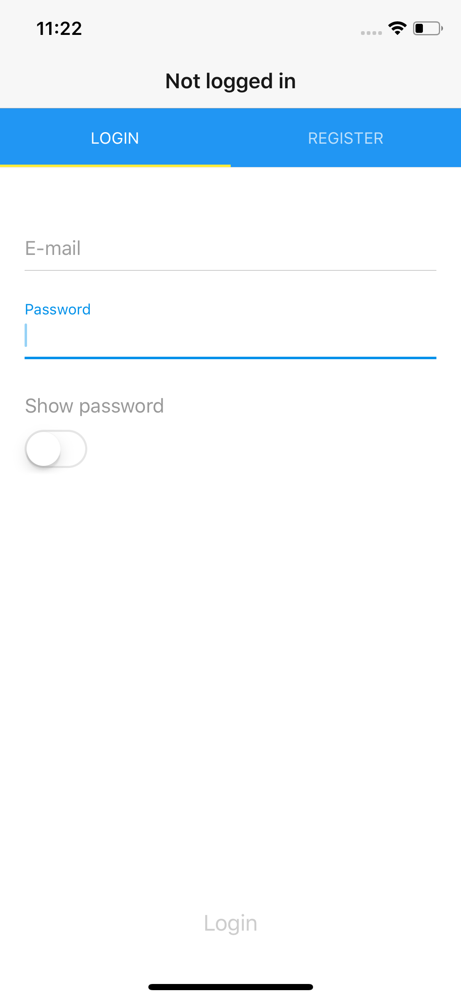

# React Native Hapijs Client

This is the react native client application for the hapijs [server](https://github.com/SoftwareBrothers/hapijs-mongoose-app-bootstrap)

## What is inside

**Login and Registration logic**

<kbd></kbd>

**Linter configuration**

just run `npm lint` to perform all checks

**Automated tests**

Application has `jest` with `enzyme` configured.
just run `npm test` to perform test

## How to use it

to run the app:

1. download the [server code](https://github.com/SoftwareBrothers/hapijs-mongoose-app-bootstrap) and run it (according to its documentation)
2. install packages: `npm install`
3. run the application using one of avaliable commands:

  - npm start
  - npm run ios
  - npm run android

## About the app skeleton

Project was bootstrapped with [Create React Native App](https://github.com/react-community/create-react-native-app).

The most recent version of the guide related to Create React Native App is available [here](https://github.com/react-community/create-react-native-app/blob/master/react-native-scripts/template/README.md).image
[./docs/screens/not-logged-in.png]: 

## License

react-native-hapijs-client is Copyright © 2018 SoftwareBrothers.co. It is free software, and may be redistributed under the terms specified in the [LICENSE](LICENSE) file.

## About SoftwareBrothers.co

We are a software company who provides web and mobile development and UX/UI services, friendly team that helps clients from all over the world to transform their businesses and create astonishing products.

* We are available to [hire](https://softwarebrothers.co/contact).
* If you want to work for us - checkout the [career page](https://softwarebrothers.co/career).
